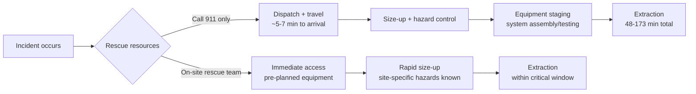

# Title Question: [Joey adds here]

## TLDR

[Joey adds just 1 sentence here...maybe a few bullet points, if needed]

## Overview

In high-hazard industries (construction, utilities/power, petroleum, and similar sectors), emergency response planning is undergoing a noticeable operational shift. Confined space and fall protection (high angle/suspension) rescue planning is moving away from exclusive reliance on public 911 systems and toward **on-site resources** that are integrated into the planning process and are present during high-consequence work. This change reframes rescue as part of the job plan, directly influencing extraction speed, the likelihood of escalation, and the human and financial consequences when something goes wrong.

---

---

## Why “Call 911” Often Isn’t Enough

When public emergency response systems are relied upon, rescue timelines must account for:

- Unit dispatch and response time  
- Locating the victim on a large/complex site  
- Scene size-up and hazard mitigation  
- Equipment staging, system assembly, and testing  
- Lockout/tagout and other controls  
- Extraction operations (often extended by site complexity, resource availability, or lack of technical capability)

These delays increase when units are already committed to other emergencies or when local resources are not trained or equipped for the specific rescue scenario. Some sites attempt to fill the gap by using minimally trained personnel for basic non-entry confined space retrieval or simple high-angle tactics. While those methods can work in simple conditions, they may be insufficient when conditions rapidly deteriorate or when the scenario exceeds the assumptions of the “easy rescue.”

---

## Uneven Adoption Across Industries

This shift has diffused unevenly across sectors. Industrial environments such as refineries, power plants, petroleum, and aviation-type operations more often treat rescue readiness as part of daily operational control (e.g., permit systems and contractor interfaces). In one oil and gas dataset (2006–2017), **36 fatal confined space accidents resulted in 55 deaths and 30 injuries**, with contractors involved in **more than 90% of fatalities** (Naghavi et al., 2019). That matters because contractors are frequently the workers performing high-consequence tasks, and when something fails, the impact lands first on them.

At the same time, many contractors and sectors remain behind due to budget limitations, lack of awareness, and underestimation of risk. Wilson et al. (2012) found that **57%** of surveyed companies relied on the fire department for permit-required confined space emergency response—showing that dependence on outside resources remains common.

---

## Confined Spaces: Rescue Attempts Can Create More Victims

Confined space incidents demonstrate how quickly a problem becomes fatal and how frequently rescues create additional victims. Selman et al. (2018) estimated confined space fatality rates at **0.05–0.08 deaths per 100,000 workers** and found that up to **17%** of confined space deaths involved individuals attempting rescue. In hazardous atmospheres, untrained coworkers may enter impulsively and become victims themselves—especially when the only “plan” is immediate entry without controls (Selman et al., 2018).

---

## Time Matters: Public Response vs. Technical Reality

Wilson et al. (2012) reported median arrival times of approximately **5 minutes** for engines and **7 minutes** for technical rescue units in confined space contexts. However, the estimated total rescue time ranged from **48–123 minutes**, increasing to **70–173 minutes** when hazardous materials were involved (Wilson et al., 2012). This aligns with real-world response realities: arrival does not equal extraction. Time is consumed by assessment, equipment movement, set-up, testing, hazard control, and navigation of large sites—before the rescue itself even begins.

In time-critical situations—injury, hazardous atmosphere, unexpected medical emergency—these delays directly influence survivability.

---

## Fall Protection: Arrested Falls Still Require Rescue

Fall protection can stop a fall without resolving the emergency. A worker may be suspended and unable to self-rescue due to:

- Injury  
- Medical event (seizure, diabetic emergency, syncope, stroke, heart attack)  
- Inability of untrained rescuers to move and package an unconscious person safely  
- Physical limitations of equipment access (lift cannot reach due to uneven ground or obstructions)

Rauch et al. (2019) supports the time-critical nature of suspension, observing pre-syncopal symptoms in **30%** of tests and reporting a minimum time to pre-syncope of **13.4 minutes**. Because of this, rescue planning cannot rely exclusively on convenient “best case” methods (e.g., tripod retrieval, scissor lift pickup) when those methods may not be feasible under real constraints.

---

## What This Shift Improves — and What It Costs

### Benefits
- Reduces time between “problem recognized” and extrication  
- Decreases the likelihood of escalation into a fatal event  
- Reduces secondary-victim risk from impulsive, untrained rescue attempts (Selman et al., 2018)  
- Improves viability in time-critical fall suspension scenarios (Rauch et al., 2019)

### Challenges
- Cost and staffing constraints in industries with finite budgets  
- Training requires more than brief instruction; it requires qualification, rehearsal, and maintenance  
- Readiness demands planning, ongoing competency, and operational integration (Wilson et al., 2012)

---

## Conclusion

This operational shift reflects a broader recognition: in high-hazard work, emergency response must be treated less like **“call 911 and wait”** and more like **a planned, integrated component of the work itself**. When consequences are high and time is critical, on-site rescue readiness can determine whether an incident ends as a rescue—or becomes a recovery.

---

## Appendix

# Professional standby rescue & technical rescue services (examples)

| Provider | Service focus | Good fit for | Website |
|---|---|---|---|
| Total Safety | Industrial emergency response + standby rescue (confined space / high-angle) | Large industrial sites, turnarounds, outages, multi-site programs | [totalsafety.com](https://www.totalsafety.com/industrial-rescue-services/) |
| SITEX Solutions | On-site confined space rescue + standby rescue teams | Sites that want integrated, on-site rescue coverage during high-risk work | [sitexsolutions.com](https://sitexsolutions.com/rescue-services/confined-space-rescue-services/) |
| Maddox Industrial Group | 24/7 standby rescue + confined space support (plus rope-access capability) | Industrial maintenance/projects needing difficult-access support + standby coverage | [maddoxindustrial.com](https://www.maddoxindustrial.com/confined-space-rescue-services) |
| Industrial Rescue | Standby rescue; confined space rescue; high-angle rope access | Industrial and construction environments needing dedicated standby teams | [industrialrescue.com](https://www.industrialrescue.com/services/) |
| DCS Rescue | Confined space rescue + technical rope rescue + EMS capability | Permit-required confined space work needing qualified rescue/medical response | [dcsrescue.com](https://dcsrescue.com/confined-space-rescue/) |
| Pro Safety & Rescue | Confined space rescue + rope rescue capability + safety support | Job sites needing rescue capability plus broader safety/EMS support | [prosafetyandrescue.com](https://www.prosafetyandrescue.com/solutions/confined-space-rescue/) |
| Rescue Solutions, LLC | Training + standby + rescue services (incl. EMT/paramedic/hazmat capability) | Companies that want a combined training + standby coverage partner | [rescuesolutionsllc.com](https://rescuesolutionsllc.com/services/) |
| NAES (Power Plant focused) | 24/7 standby high-angle + confined space rescue program | Power generation facilities and similar continuous-ops environments | [naes.com](https://www.naes.com/stand-by-confined-space-rescue/) |
| TekSolv | Rescue services with pre-planning / permit support + trained personnel | Facilities that want rescue support tied into permit execution and planning | [teksolv.com](https://www.teksolv.com/rescue-services) |
| Elevated Safety | Stand-by rescue (confined space teams + rope rigging/supervision) | Work-at-height and difficult-access jobs needing rope systems oversight | [elevatedsafety.com](https://elevatedsafety.com/Services/stand-by-rescue/) |
| Roco Rescue | Standby rescue + heavy emphasis on rescue training (industrial/confined space/high-angle) | Teams building internal capability + sites that also want standby coverage | [rocorescue.com](https://rocorescue.com/standby-rescue/) |

Source notes (what each company publicly advertises): Total Safety’s industrial rescue/standby positioning and OSHA/NFPA references ; SITEX on-site confined space rescue + standby teams ; Maddox Industrial 24/7 standby rescue + confined space services and rope-access capability ; Industrial Rescue services listing (confined space + high-angle rope access) ; DCS Rescue technical rescue/EMS positioning ; Pro Safety & Rescue rope rescue + confined space rescue claims ; Rescue Solutions “training to standby to rescue” and deploy/availability language ; NAES “24/7” standby high-angle + confined space rescue language ; TekSolv preplanning/permit management + trained personnel language ; Elevated Safety stand-by rescue scope ; Roco standby rescue staffing/training positioning .

## How to vet a standby rescue / technical rescue vendor (OSHA-aligned)

Use this as a quick RFP / pre-qual checklist for **confined space** and **fall protection (suspension/high-angle)** standby rescue coverage.

### Confined space standby rescue (permit-required)
- [ ] **They can reach the victim in *your* spaces** (not just “we do confined space rescue”) — require a site walkdown and a space list.
- [ ] **Prove capability + proficiency**: ask for a written statement of capability, staffing plan, and equipment list for the specific hazards (atmospheric, engulfment, vertical entry, etc.).
- [ ] **Practice rescues are documented**: require drill records showing **simulated rescue practice at least every 12 months** (or evidence of an actual rescue within that period), and require a **practice run** in a representative space before first deployment.
- [ ] **Integration into the job plan**: confirm how they interface with permits, attendants, gas testing, and LOTO / hazard control.
- [ ] **Access for rescuers**: confirm they will be given access to permit spaces so they can plan and rehearse.

**References (confined space):**
- OSHA General Industry PRCS standard **29 CFR 1910.146** and **Appendix F** (rescue service evaluation + practice rescues).  
- OSHA Construction confined spaces **29 CFR 1926.1211** (rescue and emergency services; practice rescues at least annually).

### Fall protection / suspended worker rescue (prompt rescue requirement)
- [ ] **Written rescue plan** that provides **prompt rescue** (or confirms self-rescue capability), including method-by-method plans (MEWP/lift, ladder pickoff, rope-based lower/raise, controlled descent, etc.).
- [ ] **Time objective + constraints**: define target rescue time and what happens when the “easy” method isn’t available (lift can’t reach, obstructions, uneven ground, power loss, etc.).
- [ ] **Equipment staged and immediately accessible** (not in a trailer 10 minutes away), with inspection logs.
- [ ] **Dedicated staffing during exposure** (not “we’ll show up if you call us”).

**References (fall protection prompt rescue):**
- OSHA General Industry fall protection **29 CFR 1910.140(c)(21)** (prompt rescue).  
- OSHA Construction fall protection **29 CFR 1926.502(d)(20)** (prompt rescue or self-rescue).

### Technical rescue competence (industry standard alignment)
- [ ] Confirm their training/operations align to **NFPA 2500** (technical rescue operations & training + life safety rope/equipment standard).
- [ ] Ask for a skills matrix (who is qualified for what: attendant, entry rescue, rope tech, medic, etc.) and recent drill cadence.

**Reference (industry standard):**
- **NFPA 2500** standard development + publication pages.

Sources: OSHA PRCS 29 CFR 1910.146 (and rescue practice language) ; OSHA 1910.146 Appendix F (rescue team/service guidance) ; OSHA fall protection 1910.140(c)(21) (prompt rescue) ; OSHA construction fall protection 1926.502(d)(20) (prompt rescue or self-rescue) ; OSHA construction confined space rescue 1926.1211 (rescue & annual practice) ; NFPA 2500 standard pages .

## References (APA 7th)

Naghavi, Z., Momenyan, S., & Salehi, M. (2019). Exploring the contributory factors of confined space accidents using accident investigation reports and semistructured interviews. *Safety and Health at Work, 10*(3), 282–288.

Rauch, S., Schenk, K., Strapazzon, G., et al. (2019). Suspension syndrome: A potentially fatal vagally mediated circulatory collapse—An experimental randomized crossover trial. *European Journal of Applied Physiology, 119*(6), 1353–1365.

Selman, J., Spickett, J., Jansz, J., & Mullins, B. (2018). An investigation into the rate and mechanism of incident of work-related confined space fatalities. *Safety Science, 109*, 333–343.

Wilson, M. P., Madison, H. N., & Healy, S. B. (2012). Confined space emergency response: Assessing employer and fire department practices. *Journal of Occupational and Environmental Hygiene, 9*(2), 120–128.

